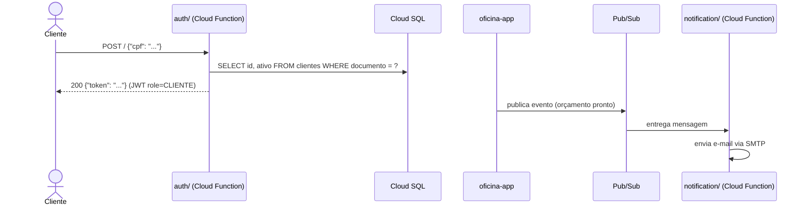

# oficina-auth-function

Functions Serverless (Google Cloud Functions Gen2) do Tech Challenge Fase 3
(Pós-Tech SOAT).

Um dos 4 repositórios exigidos pelo desafio. Duas functions independentes,
cada uma em seu próprio módulo Maven, decisão detalhada em
[RFC-003](https://github.com/robsonago/oficina/blob/main/docs/rfcs/003-estrategia-autenticacao.md).

Dockerfile não se aplica a este repositório (Cloud Functions não usa Docker).

## Índice

1. [Diagrama deste repositório](#1-diagrama-deste-repositório)
2. [`auth/` — autenticação por CPF](#2-auth--autenticação-por-cpf)
3. [`notification/` — envio de notificação](#3-notification--envio-de-notificação)
4. [Pré-requisitos de infraestrutura](#4-pré-requisitos-de-infraestrutura)
5. [CI/CD](#5-cicd)
6. [Deploy manual (referência)](#6-deploy-manual-referência)
7. [Ambiente ativo](#7-ambiente-ativo)

---

## 1. Diagrama deste repositório



Diagrama de sequência completo (auth + abertura de OS) em
[`oficina/docs/arquitetura/diagrama-sequencia.md`](https://github.com/robsonago/oficina/blob/main/docs/arquitetura/diagrama-sequencia.md).
Diagrama geral de todo o sistema em
[`oficina/docs/arquitetura/diagrama-componentes.md`](https://github.com/robsonago/oficina/blob/main/docs/arquitetura/diagrama-componentes.md).

## 2. `auth/` — autenticação por CPF

Recebe um CPF via HTTP, valida o formato (mesma regra de dígito verificador
usada em `CpfCnpjValidator` na aplicação principal
[`oficina`](https://github.com/robsonago/oficina)), confirma que existe um
cliente ativo com esse documento no Cloud SQL, e devolve um JWT — assinado
com a mesma chave (`JWT_SECRET`) e formato usados pela aplicação principal,
com a claim `role=CLIENTE` — pronto para autenticar chamadas às APIs
protegidas.

Conecta no Cloud SQL via [Cloud SQL Connector (socket
factory)](https://github.com/GoogleCloudPlatform/cloud-sql-jdbc-socket-factory),
autenticando através da service account da function (a mesma usada pela
aplicação no GKE via Workload Identity), sem senha de rede exposta além da
credencial do usuário de aplicação.

**Requisição:**

```bash
curl -X POST https://<url-da-function> \
  -H "Content-Type: application/json" \
  -d '{"cpf": "52998224725"}'
```

**Respostas:**

| Status | Corpo | Quando |
|---|---|---|
| 200 | `{"token": "..."}` | CPF válido e cliente ativo encontrado |
| 400 | `{"mensagem": "CPF inválido", "status": 400}` | CPF com formato/dígito verificador inválido |
| 404 | `{"mensagem": "Cliente não encontrado", "status": 404}` | Nenhum cliente com esse documento |
| 403 | `{"mensagem": "Cliente inativo", "status": 403}` | Cliente existe mas está desativado |

## 3. `notification/` — envio de notificação

Disparada por mensagem no tópico Pub/Sub (publicado pela aplicação principal
via `PubSubEmailAdapter` quando um orçamento fica disponível — ver
[ADR-001](https://github.com/robsonago/oficina/blob/main/docs/adrs/001-padrao-comunicacao-notificacoes.md)).
Decodifica o evento e manda o e-mail de fato via SMTP — a parte
síncrona/lenta que antes rodava dentro da própria aplicação. Não expõe HTTP,
não há requisição/resposta para chamar diretamente.

## 4. Pré-requisitos de infraestrutura

Ambas as functions rodam com a service account `oficina-app-cloudsql`
(criada em [`oficina-infra-db`](https://github.com/robsonago/oficina-infra-db)),
que precisa ter acesso de leitura a estes secrets do Secret Manager antes do
deploy funcionar:

- `oficina-db-password` (gerenciado pelo Terraform de `oficina-infra-db`)
- `oficina-jwt-secret`, `oficina-mail-username`, `oficina-mail-password`
  (criados manualmente, fora de qualquer Terraform — a permissão de acesso
  a eles é concedida pelo Terraform de `oficina-infra-db`, mas o **valor**
  dos secrets em si não)

**Atenção:** como a service account é recriada do zero a cada
`terraform destroy`+`apply` de `oficina-infra-db`, o deploy dessas functions
falha com `Permission denied on secret` se essa recriação aconteceu e o
Terraform de `oficina-infra-db` ainda não rodou de novo (ou se a permissão
não foi formalizada lá como código).

O tópico Pub/Sub é provisionado em
[`oficina-infra-k8s`](https://github.com/robsonago/oficina-infra-k8s).

## 5. CI/CD

O workflow [`.github/workflows/ci-cd.yml`](.github/workflows/ci-cd.yml) roda
automaticamente a cada push:

- Compila e testa as duas functions sempre.
- Publica (`gcloud functions deploy`) as duas em push na branch `homolog`
  (ambiente de homologação) ou `main` (produção) — deploy automático nos
  dois ambientes, não só em um.

Autenticação via Workload Identity Federation (sem chave de service account
em segredo).

## 6. Deploy manual (referência)

Normalmente feito pelo CI/CD (seção acima); só para rodar manualmente:

```bash
# auth/
gcloud functions deploy oficina-auth-<ambiente> \
  --gen2 --region=southamerica-east1 --runtime=java21 \
  --source=auth --entry-point=br.com.fiap.challange.oficina.authfunction.AuthFunction \
  --trigger-http --allow-unauthenticated \
  --memory=512Mi --timeout=30s \
  --set-env-vars="INSTANCE_CONNECTION_NAME=<projeto>:<regiao>:oficina-postgres,DB_NAME=oficina_<ambiente>,DB_USER=oficina,JWT_EXPIRATION=86400000" \
  --set-secrets="DB_PASSWORD=oficina-db-password:latest,JWT_SECRET=oficina-jwt-secret:latest" \
  --service-account=oficina-app-cloudsql@<projeto>.iam.gserviceaccount.com

# notification/
gcloud functions deploy oficina-notification-<ambiente> \
  --gen2 --region=southamerica-east1 --runtime=java21 \
  --source=notification --entry-point=br.com.fiap.challange.oficina.notificationfunction.NotificationFunction \
  --trigger-topic=oficina-notificacoes-<ambiente> \
  --memory=256Mi --timeout=60s \
  --set-env-vars="MAIL_HOST=smtp.gmail.com,MAIL_PORT=587,MAIL_AUTH=true,MAIL_STARTTLS=true,MAIL_FROM=oficina@localhost" \
  --set-secrets="MAIL_USERNAME=oficina-mail-username:latest,MAIL_PASSWORD=oficina-mail-password:latest" \
  --service-account=oficina-app-cloudsql@<projeto>.iam.gserviceaccount.com
```

## 7. Ambiente ativo

| Function | Ambiente | URL |
|---|---|---|
| `oficina-auth-homolog` | Homologação | `https://oficina-auth-homolog-rqwoyvcqha-rj.a.run.app` |
| `oficina-auth-producao` | Produção | `https://oficina-auth-producao-rqwoyvcqha-rj.a.run.app` |

`oficina-notification-homolog`/`producao` não têm URL pública (disparadas
por Pub/Sub, não por HTTP). URLs de Cloud Functions Gen2 são estáveis entre
redeploys — diferente do IP público da aplicação principal (ver README de
[`oficina-infra-k8s`](https://github.com/robsonago/oficina-infra-k8s)), não
precisam ser atualizadas a cada recriação da infra.
